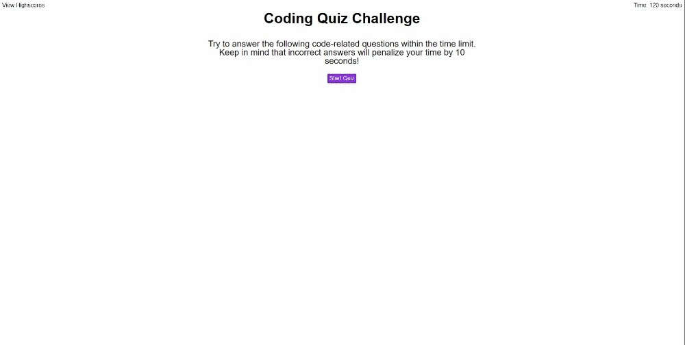

# My Coding Quiz

## Description
This was a fun assignment. I struggled with the local storage at first but then managed to wrap my head around all the JSON.
<br>

## Deployment Link 🔗
[Deployed link](https://xmoonphasex.github.io/my-coding-quiz-C4/)<br>
[Repo](https://github.com/XMoonphaseX/my-coding-quiz-C4)<br>

## User Story 📘
```
AS A coding boot camp student
I WANT to take a timed quiz on JavaScript fundamentals that stores high scores
SO THAT I can gauge my progress compared to my peers
```

## Acceptance Criteria ✅
```
GIVEN I am taking a code quiz
WHEN I click the start button
THEN a timer starts and I am presented with a question
WHEN I answer a question
THEN I am presented with another question
WHEN I answer a question incorrectly
THEN time is subtracted from the clock
WHEN all questions are answered or the timer reaches 0
THEN the game is over
WHEN the game is over
THEN I can save my initials and my score
```

## Demo Given
The following animation demonstrates the application functionality:
<br>

## Deployment gif

<br>

## Credits
To me because I actually enjoy doing JS
<br>

## Licence 🔑
MIT © XMoonphaseX
